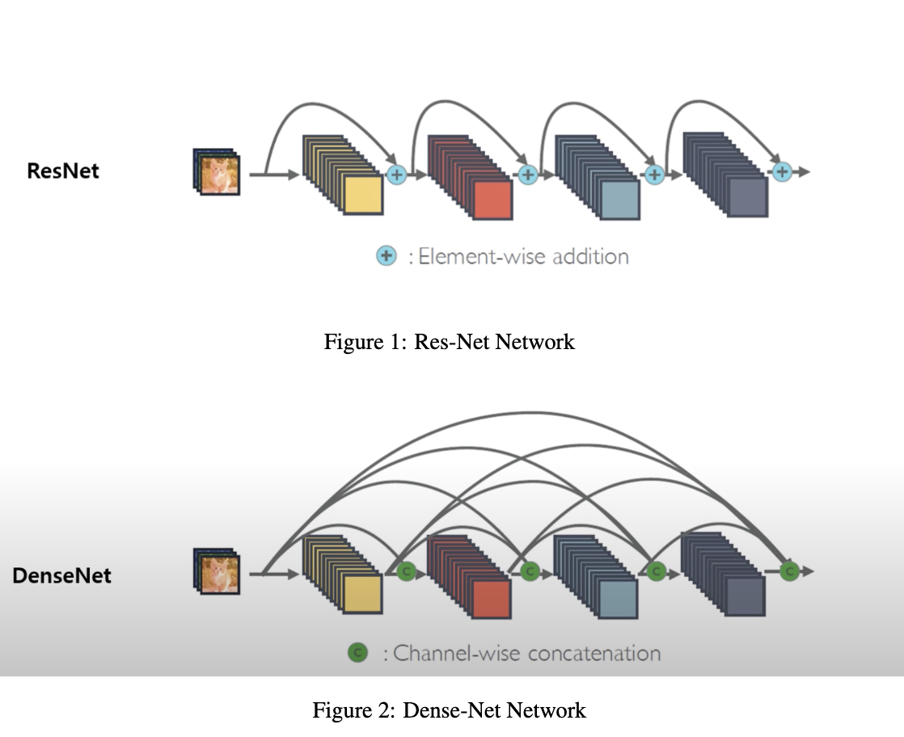
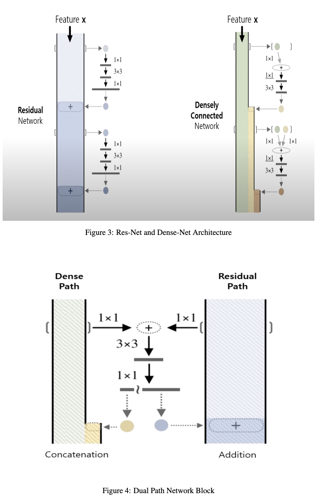
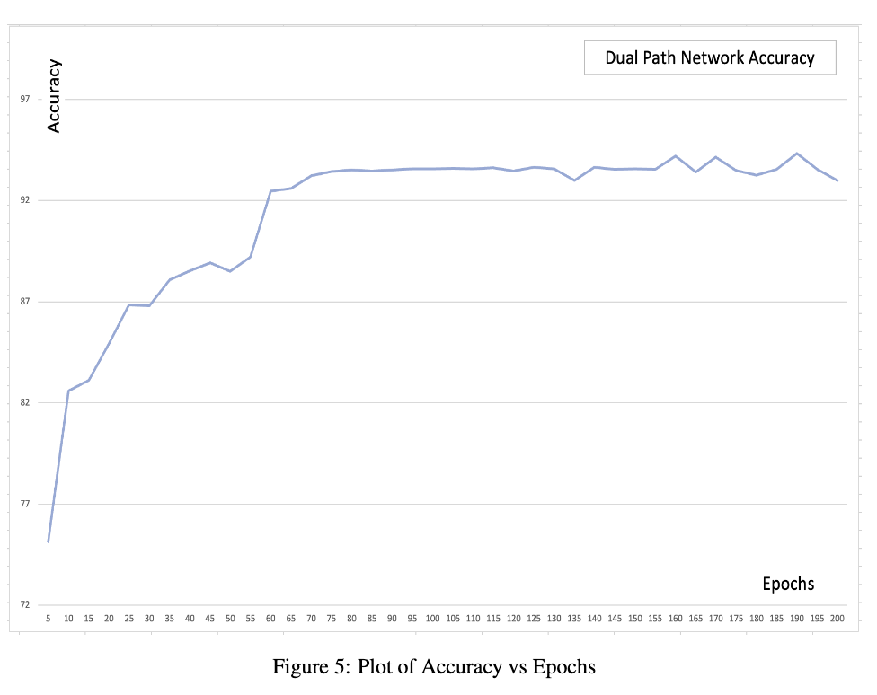

# 1. Abstract
Image classification using deep learning finds multiple applications in today’s
world. Earlier there was a crunch of ample data availability and computational
power, but today huge amount of data is available along with high computational
power. Today it is possible to train deep learning models having large parameters.
But it was observed that in deep models sometimes the accuracy degrades instead
of improving. The residual network technique solves this issue by addition of
input into the output of each residual block. This project proposes and uses a
modified version of a Residual network known as a Dual Path Network which is
a combination of Res-Net as well as Dense-Net and rectifies the shortcomings of
Res-Net.

# 2. Introduction
Deep learning is a type of machine learning that uses a neural network to learn without being explicitly
programmed. A convolutional neural network is one of the many learning algorithms which we use
in deep learning. It is mainly used for applications involving image classification, computer vision,
pattern recognition, and visualization. It takes images as input and then sweeps the filter through them
to calculate dot product values which help to identify patterns and features in images. This process
is continued multiple times which forms a network. The deeper the network, the more complex
features it could learn. But it was observed that adding more layers to a deep network could create
two major issues. First, it could vanish the gradient values stopping the convergence, and second, it
could make training stagnant and degrade the model accuracy. The first problem was addressed by
various methods like batch normalization, ReLu activation, dropouts, Xavier weight initialization, etc.
For addressing the second problem use of residual neural networks came into the picture. Res-Net
adds input to the output of each residual block. This prevents model accuracy from degrading if not
improving. Figure 1 shows the branch of the residual neural network. We could see how the input X
is added to the output in the bottleneck residual block. Another network that can be used to address
the second problem is Dense-Net. Unlike Res-net, Dense-Net concatenates the input with the output
of every block making the information flow more robust. Figure 2 shows the information flow in
Dense-Net. In this project, we will use a combination of both Res-Net and Dense-Net known as a
Dual Path Network. We will see the architecture, working, and advantages of the Dual Path Network
in the next section

# 3. Dual Path Network
Dual Path Network is the combination of two deep learning networks i.e Res-Net and Dense-Net.
In this section we will cover the advantages of a Dual Path Network over Res-Net/Dense-Net, the
architecture of network, and its working.

### 3.1 Advantages
Res-Net and Dense-Net networks follow the same principle of skip connection with some different
implementations. Both have their advantages as well as disadvantages associated with each. In the
residual neural network, the filtered features are added to the original feature pipe i.e. it updates the
original feature pipe without increasing its width. This can be seen properly in Figure 3. Whereas as
can be seen in Figure 3, in Dense-Net the filtered features are concatenated to the original feature
pipe. It adds new features to the already existing pipe making it thick. Since Res-Net updates the
value of the feature after every block so the feature redundancy is reduced in the case of Res-Net
but it is not capable of exploring new features. Dense-Net, on the other hand, reuses the features
without updating them so feature redundancy is very high in dense-net and it can explore new features.
The model can be made more accurate if we combine both networks. This is known as a Dual path
network. The Dual-path network has advantages of both, it explores new features using Dense-Net
and reduces feature redundancy using Res-Net.

### 3.2 Architecture
Dual-Path Network is formed using the bottleneck structure blocks similar to Res-Net. Figure 5
shows the architecture of a single Dual-Path network block. The dense features from the dense path
and residual features from the residual path are added after 1x1 convolution at first. Then the added
features are passed through 3x3 and 1x1 convolutional layers. The output is then split into the dense
part and the residual part. The split size of the residual part is the same as the size of the residual
path. The remaining part is concatenated into the dense path.

# 4. Experiment

### 4.1 Dataset
The model is trained using the CIFAR 10 dataset. CIFAR 10 dataset consists of 50,000 labeled images
for training and 10,000 labeled images for testing. The summary and classification of CIFAR 10 data
are shown in Table 1. Apart from this 2000 private test images were provided which are used for
prediction

### 4.2 Layers
Model has 4 stacks of layers. First stack have 3 layers, Second stack have 4 layers, third stack have
20 layers and final stack have 3 layers. The summary of model can be seen in Table 2.

### 4.3 Observations and Hyperparameters
The model was trained on multiple hyperparameters and the validation accuracy was calculated for
each case. A few cases are attached in the appendix. The model was retrained on complete training
samples corresponding to the highest accuracy hyperparameters. The final hyperparameters used can
be seen in Table 3.

# 5. Results
The final accuracy was found to be 94.32% on public test set at 190 epochs. The variation of accuracy
basis epoch can be seen in Figure 5. We could conclude that Dual-Path network performs better as
compared to Res-Net and Dense-Net. The Dual-path network has advantages of both, it explores new
features using Dense-Net and reduces feature redundancy using Res-Net.

# 6. Referances
[1] Chen, Yunpeng, et al. “Dual path networks.” (2017)
[2] He, Kaiming, et al. “Deep residual learning for image recognition.” (2016)
[3] Huang, Gao, et al. “Densely connected convolutional networks.” (2017)

# 7. Appendix

